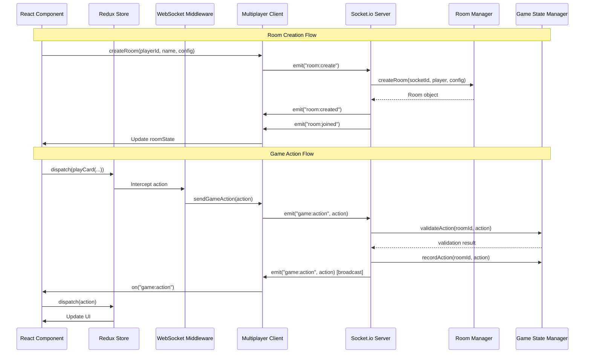
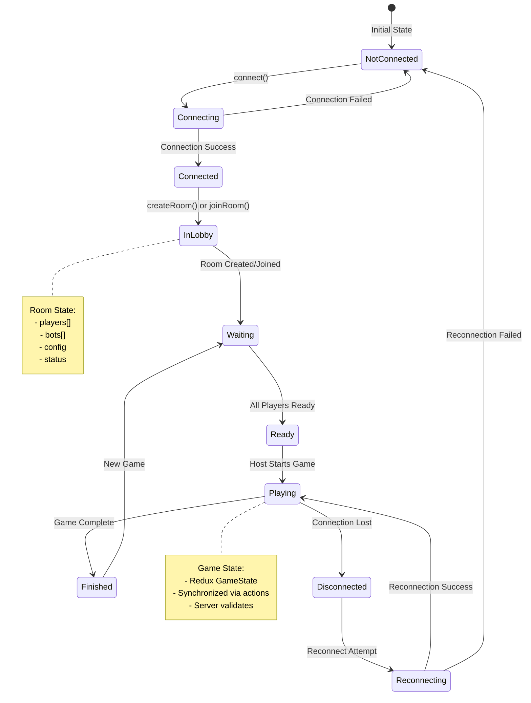
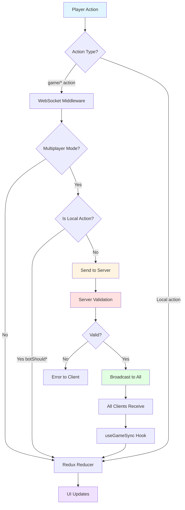
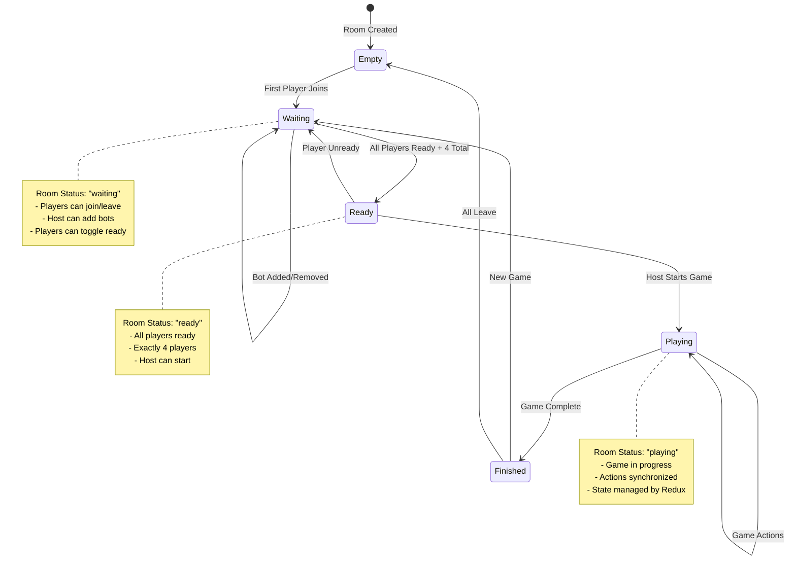
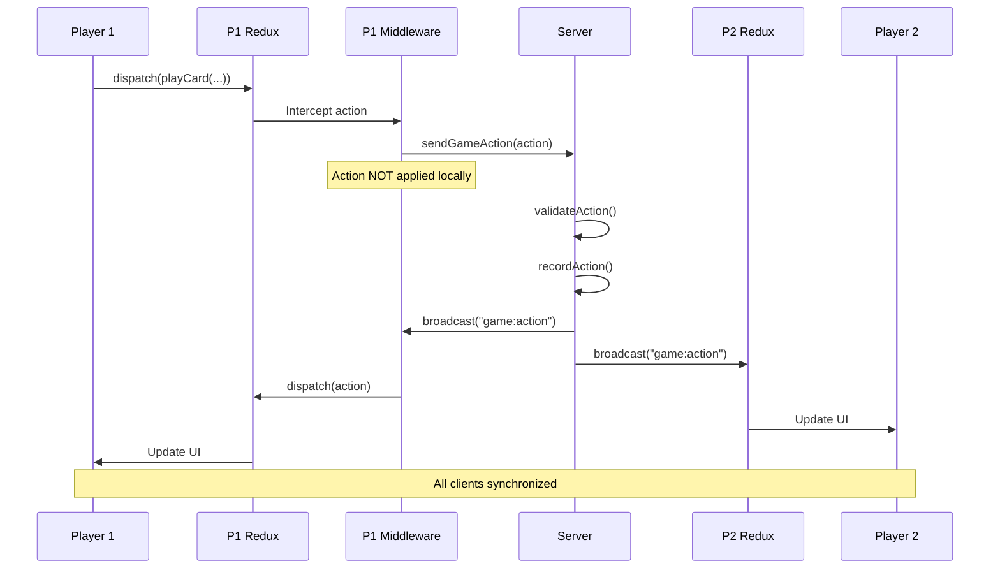
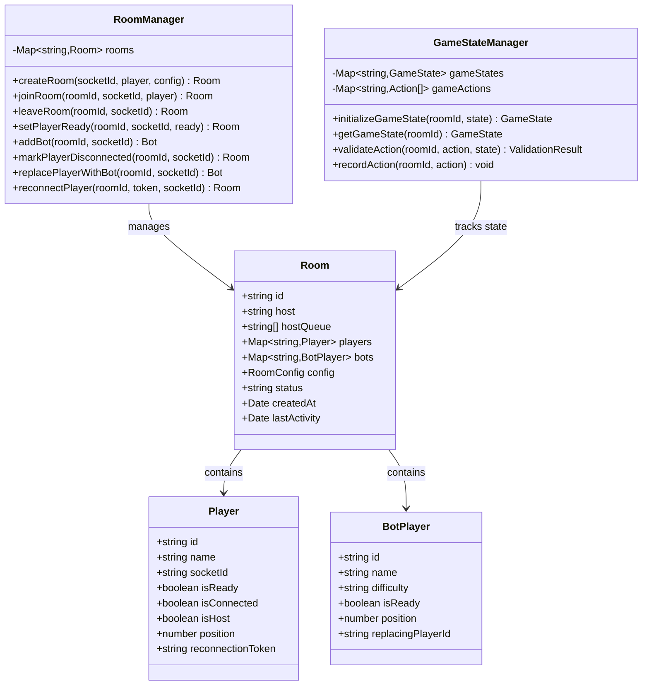
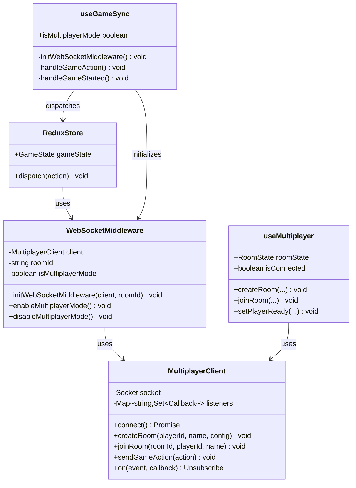

# Multiplayer Mode - Current State & Architecture

## 📊 Current Implementation State

### ✅ Completed Infrastructure

#### 1. **Server-Side Components**
- **Local Server** (`server/local-server.js`): Node.js server with Socket.io on port 8080
  - Room management (create, join, leave)
  - Player management (ready status, host transfer)
  - Bot management (add, remove, takeover on disconnect)
  - Game action validation and broadcasting
  - Disconnection/reconnection handling (30s bot takeover)
  
- **Room Manager** (`server/roomManager.js`): Room lifecycle management
  - 6-character alphanumeric room IDs
  - Host queue for automatic host transfer
  - Player position assignment (0-3)
  - Bot replacement system for disconnected players
  - Reconnection token system

- **Game State Manager** (`server/gameStateManager.js`): Basic game state tracking
  - Stage and turn tracking
  - Action history (last 100 actions)
  - Basic action validation
  - State initialization and updates

#### 2. **Client-Side Components**
- **Multiplayer Client** (`src/utils/multiplayer.ts`): WebSocket client wrapper
  - Singleton pattern for shared connection
  - Event-based communication
  - Room operations (create, join, leave)
  - Game action sending
  - Reconnection support

- **WebSocket Middleware** (`src/store/websocketMiddleware.ts`): Redux middleware
  - Intercepts `game/*` actions
  - Filters local-only actions (bot triggers, saga triggers)
  - Prevents action loops (server actions)
  - Configurable multiplayer mode toggle
  - Room ID tracking

- **Game Sync Hook** (`src/hooks/useGameSync.ts`): State synchronization
  - Initializes WebSocket middleware when in room
  - Listens for server game actions
  - Applies actions to Redux store
  - Handles game start events
  - Manages state updates

- **Multiplayer Hook** (`src/hooks/useMultiplayer.ts`): Room state management
  - Connection status tracking
  - Room state (players, bots, config, status)
  - Event listeners for all room events
  - Host detection
  - Reconnection token management

#### 3. **UI Components**
- **Room Lobby** (`src/components/multiplayer/RoomLobby.tsx`): Main lobby interface
- **Player List** (`src/components/multiplayer/PlayerList.tsx`): Player display
- **Ready System** (`src/components/multiplayer/ReadySystem.tsx`): Ready status and game start
- **Room Configuration Panel** (`src/components/multiplayer/RoomConfigurationPanel.tsx`): Room settings

### 🔄 Current Flow

#### Room Creation & Joining
1. Player creates room → Server generates room ID
2. Player shares room code → Other players join via code
3. Host configures room → Series length, starting bid, bot count
4. Players mark ready → All must be ready to start
5. Host starts game → Server validates and broadcasts

#### Game Action Synchronization
1. Player action → Redux dispatches action
2. WebSocket middleware → Intercepts and sends to server
3. Server validation → Validates action format and state
4. Server broadcast → Sends to all players in room
5. Client application → All clients apply action via `useGameSync`

#### Disconnection Handling
1. Player disconnects → Server marks as disconnected
2. 30-second timer → Server waits for reconnection
3. Bot takeover → Server replaces player with bot
4. Reconnection → Player uses token to reconnect
5. Bot removal → Server removes bot, restores player

### ⚠️ Known Limitations & Gaps

1. **Bot Action Execution**: Bots can be added to rooms but don't execute actions during gameplay
2. **Full State Sync**: Server only tracks basic state (stage, turn), not full game state
3. **Action Validation**: Basic validation only - no game-specific rule validation
4. **Error Recovery**: Limited state recovery mechanisms
5. **Testing**: Not fully tested across multiple devices on local network
6. **Game Initialization**: Game starts but bot actions may not trigger properly

### 📦 State Management Architecture

#### Redux Store Structure
```
gameSlice (GameState)
├── gameConfig: Game configuration (bid, trump, teammate card)
├── gameProgress: Stage, trick number, scores
├── biddingState: Current bid, bidders, timer
├── tableState: Cards on table, turn, trick winner
├── playerState: Players, hands, names, agents
├── seriesProgress: Series scores, game results
├── gameMode: Single | Series | Multiplayer
└── uiState: Animations, dealing state
```

#### Multiplayer State (Separate from Redux)
```
RoomState (in useMultiplayer hook)
├── roomId: string
├── hostSocketId: string
├── players: Player[]
├── bots: BotPlayer[]
├── config: RoomConfig
├── status: "waiting" | "ready" | "playing" | "finished"
└── allReady: boolean
```

---

## 🏗️ Orchestration Logic & State Management

### System Architecture Overview

```
┌─────────────────────────────────────────────────────────────────┐
│                        CLIENT LAYER                              │
├─────────────────────────────────────────────────────────────────┤
│                                                                  │
│  ┌──────────────┐  ┌──────────────┐  ┌──────────────┐         │
│  │   React UI   │  │  Redux Store │  │  WebSocket   │         │
│  │  Components  │◄─┤  (GameState) │◄─┤  Middleware  │         │
│  └──────────────┘  └──────────────┘  └──────────────┘         │
│         │                  │                  │                 │
│         │                  │                  │                 │
│         └──────────────────┼──────────────────┘                 │
│                            │                                    │
│                   ┌─────────▼─────────┐                         │
│                   │  useGameSync Hook │                         │
│                   │  useMultiplayer   │                         │
│                   └─────────┬─────────┘                         │
│                             │                                    │
└─────────────────────────────┼──────────────────────────────────┘
                               │
                    WebSocket  │
                    Protocol   │
                               │
┌───────────────────────────────▼──────────────────────────────────┐
│                        SERVER LAYER                             │
├─────────────────────────────────────────────────────────────────┤
│                                                                  │
│  ┌──────────────┐  ┌──────────────┐  ┌──────────────┐         │
│  │ Socket.io    │  │ Room Manager │  │ Game State   │         │
│  │ Server       │◄─┤              │◄─┤ Manager      │         │
│  └──────────────┘  └──────────────┘  └──────────────┘         │
│         │                  │                  │                 │
│         │                  │                  │                 │
│         └──────────────────┼──────────────────┘                 │
│                            │                                    │
│                   ┌─────────▼─────────┐                         │
│                   │  Game Rooms Map   │                         │
│                   │  (roomId → Room)  │                         │
│                   └───────────────────┘                         │
│                                                                  │
└─────────────────────────────────────────────────────────────────┘
```

### Component Interaction Diagram



### State Management Flow



### Action Flow Diagram



### Room State Machine



### Data Flow: Game Action Synchronization



### Server-Side State Management



### Client-Side State Management



### Key Design Patterns

1. **Singleton Pattern**: `MultiplayerClient` - Single connection shared across components
2. **Middleware Pattern**: `WebSocketMiddleware` - Intercepts Redux actions
3. **Observer Pattern**: Event listeners for WebSocket events
4. **State Machine**: Room status transitions (waiting → ready → playing → finished)
5. **Command Pattern**: Game actions as commands sent to server
6. **Repository Pattern**: `RoomManager` manages room lifecycle

---

## 🔄 State Synchronization Strategy

### Current Approach: Action-Based Synchronization

1. **Client sends action** → Server validates → Server broadcasts → All clients apply
2. **No optimistic updates** - Actions only applied after server confirmation
3. **Server is source of truth** - All validation happens server-side
4. **Action history** - Server maintains last 100 actions for debugging

### State Consistency Guarantees

- ✅ **Action Ordering**: Server broadcasts actions in order received
- ✅ **No Double Application**: Middleware prevents local application before server confirmation
- ⚠️ **Partial State Sync**: Server only tracks basic state, not full game state
- ⚠️ **No Conflict Resolution**: No mechanism for handling conflicting actions
- ⚠️ **No State Reconciliation**: Limited ability to recover from desync

### Future Improvements Needed

1. **Full State Sync**: Server should maintain complete game state
2. **State Reconciliation**: Mechanism to detect and fix desync
3. **Optimistic Updates**: Apply actions locally before server confirmation
4. **Conflict Resolution**: Handle simultaneous actions from multiple players
5. **State Snapshots**: Periodic full state snapshots for recovery

---

## 📝 Summary

### What Works
- ✅ Room creation and joining
- ✅ Player management (ready status, host transfer)
- ✅ Bot management (add, remove)
- ✅ Game action synchronization (basic)
- ✅ Disconnection detection
- ✅ WebSocket middleware integration

### What Needs Work
- ⚠️ Bot action execution during gameplay
- ⚠️ Full game state synchronization
- ⚠️ Advanced action validation
- ⚠️ State recovery mechanisms
- ⚠️ Cross-device testing
- ⚠️ Error handling and user feedback

### Next Steps
1. Implement bot action execution in multiplayer mode
2. Enhance server-side state management (full state tracking)
3. Add state reconciliation mechanisms
4. Test across multiple devices on local network
5. Improve error handling and user feedback
6. Add game-specific action validation rules
