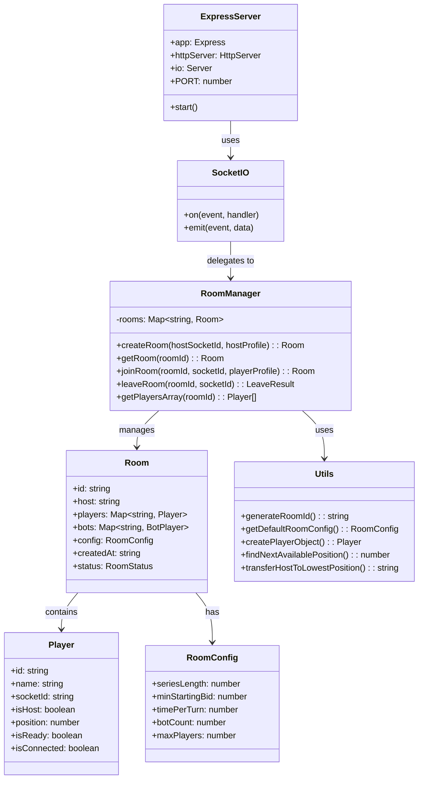
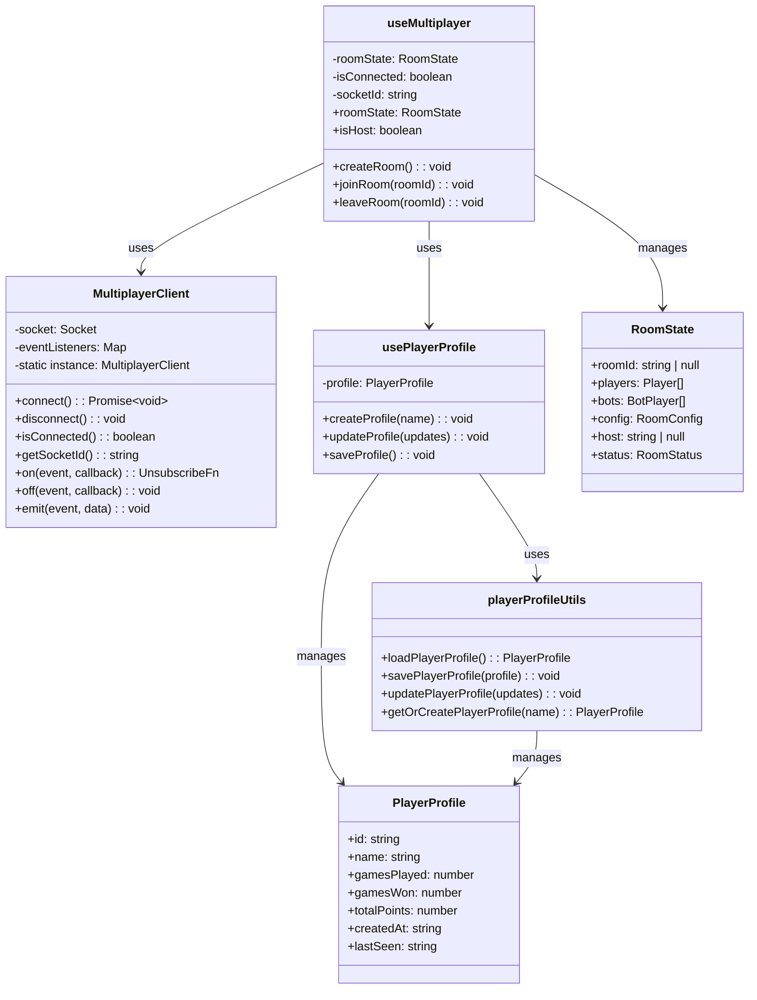
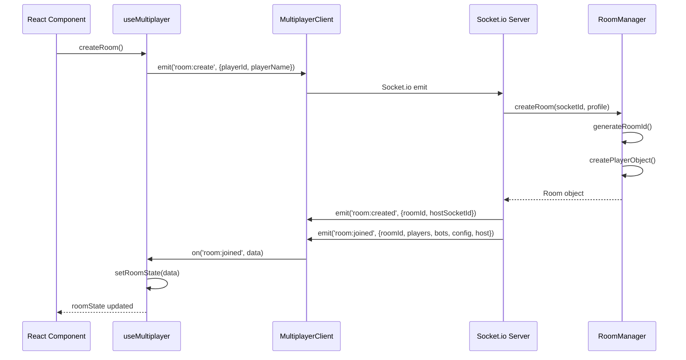
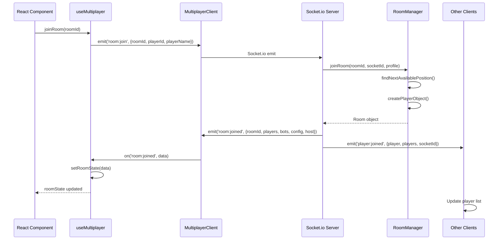
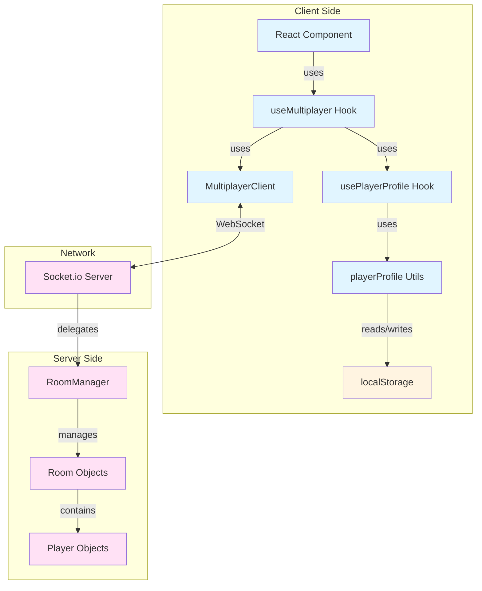
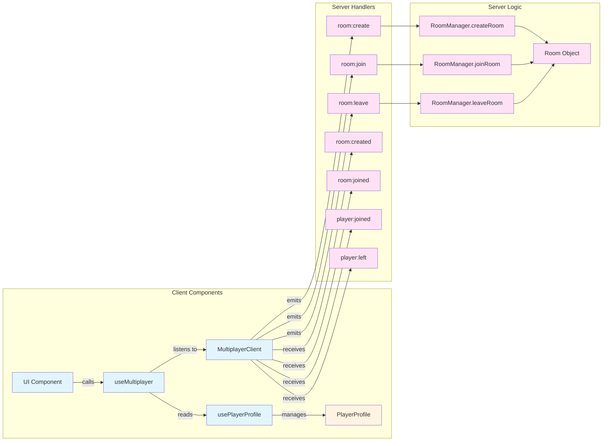
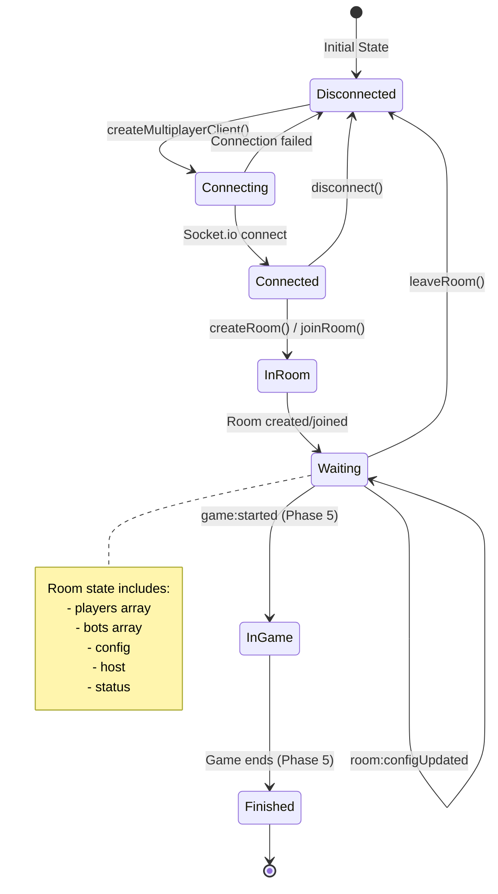

# Multiplayer Architecture - UML Diagrams

## 1. Server Architecture



## 2. Client Architecture



## 3. Data Flow: Room Creation



## 4. Data Flow: Player Joining



## 5. Event Flow Diagram



## 6. Component Interaction Diagram



## 7. State Management Flow



## 8. File Structure

```
server/
├── local-server.js          # Express + Socket.io server
├── roomManager.js           # Room management class
├── constants.js              # Constants (RoomStatus, WORDS)
├── utils.js                 # Utility functions
├── README.md                # Server documentation
└── tests/
    └── roomManager.test.js  # Room manager tests

src/
├── types/
│   └── multiplayer.ts      # TypeScript type definitions
├── utils/
│   ├── multiplayer.ts      # MultiplayerClient class
│   └── playerProfile.ts    # Profile utilities
└── hooks/
    ├── useMultiplayer.ts   # Main multiplayer hook
    └── usePlayerProfile.ts # Player profile hook
```

## Key Features Implemented

### Server Side
- ✅ Express server with Socket.io
- ✅ Room creation and management
- ✅ Player joining/leaving
- ✅ Host transfer logic
- ✅ Position assignment (0-3)
- ✅ Room full validation
- ✅ Event broadcasting

### Client Side
- ✅ TypeScript type definitions
- ✅ Player profile system (localStorage)
- ✅ WebSocket client wrapper (singleton)
- ✅ React hook for room state management
- ✅ Event listener system
- ✅ Connection status tracking
- ✅ Host detection

### Testing
- ✅ Room manager unit tests (24 tests passing)
- ✅ TypeScript compilation verification
- ✅ Linting checks

## Next Steps (Phase 3)

- Room Lobby UI components
- Player list display
- Room configuration panel
- Ready system
- Bot management
