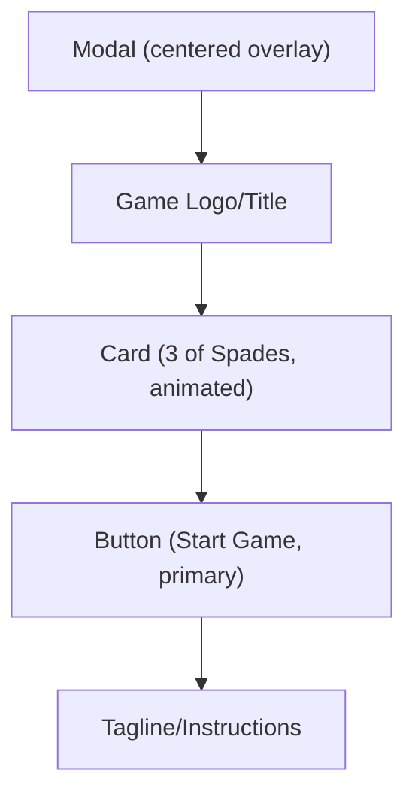
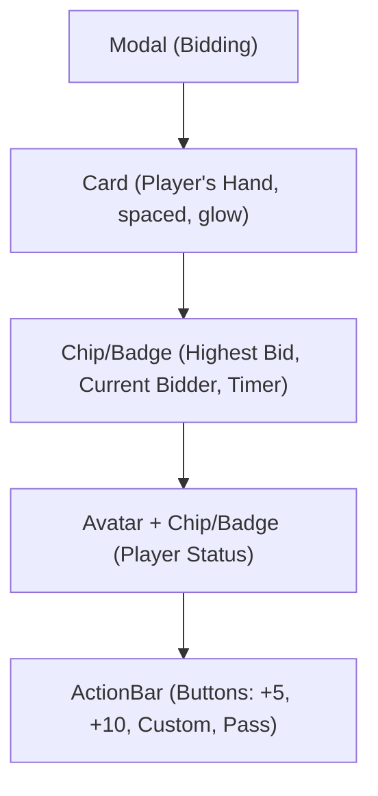
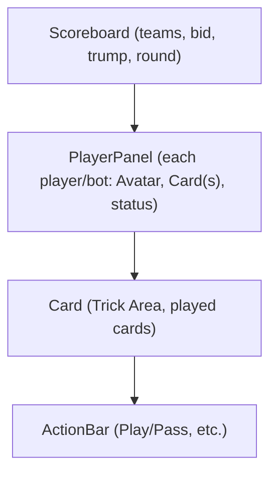
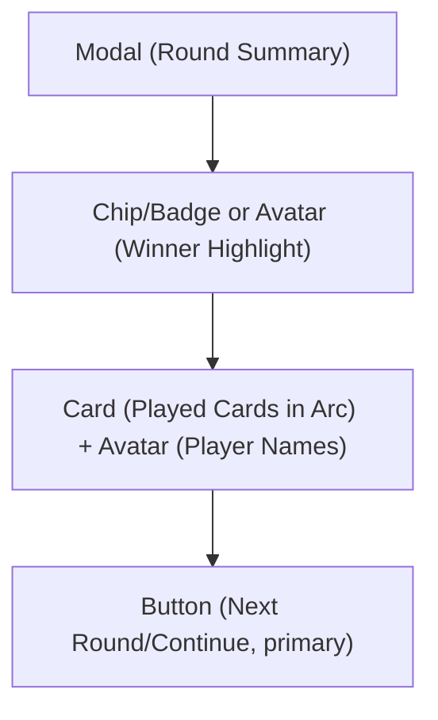
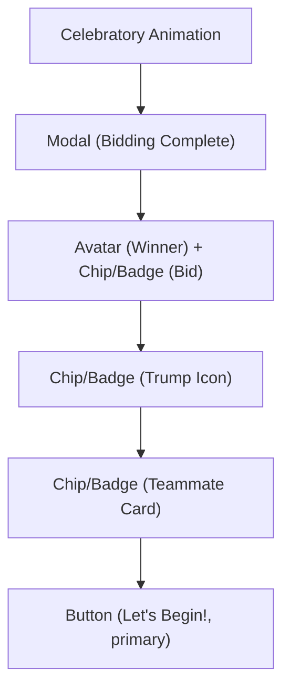
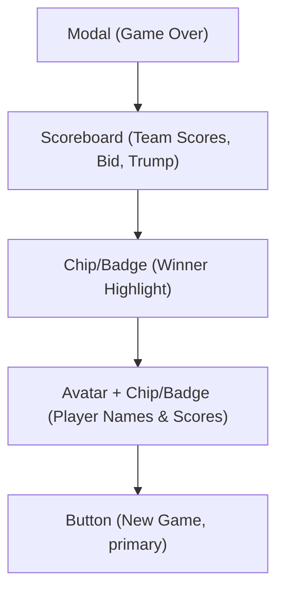
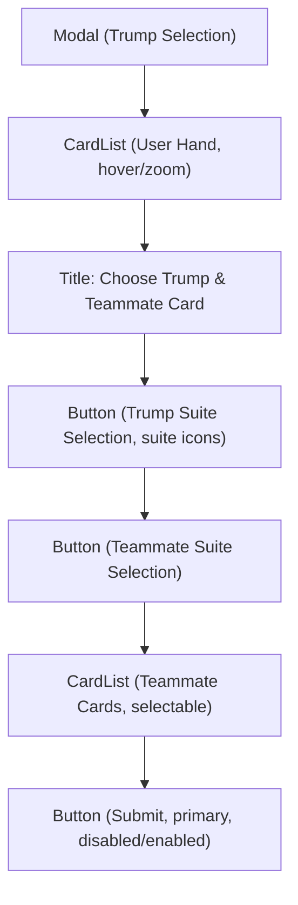

# Three of Spades Game Redesign

## Foundational Component Approach

This redesign leverages a set of atomic, reusable foundational components for consistency, scalability, and maintainability. Each page and feature is composed using these building blocks. For details on each foundational component, see [foundational-components.md](./foundational-components.md).

---

## 1. Page-by-Page Suggestions

### **Start Screen**

- Uses: **Modal**, **Button**, **Card**, **Avatar** (if showing user)
- Add a subtle, animated or textured background (felt table, soft gradient, or bokeh lights).
- Center a more prominent, stylized game logo/title above the card. Use a playful or elegant font.
- Animate the 3 of Spades card (gentle float, spin, or entrance animation) using the **Card** component.
- Make the "Start Game" button larger, with a glowing or pulsing effect. Use the **Button** component with `variant="primary"`.
- Add a short tagline or instructions below the button (e.g., "A classic trick-taking game for 4 players!").
- Ensure good contrast and large enough touch targets for mobile.

#### Visual Mockup



**Foundational Components Used:** Modal, Button, Card, (optional) Avatar

**Color Swatches:**

- Table Green (#184D47): Background
- Gold (#FFD700): Button, highlights
- Cream (#F8F5E4): Text, card
- Jet Black (#232323): Logo text

**Rich Visual Description:**

- Centered, stylized logo/title at the top in Jet Black or Gold.
- Below, a large, animated 3 of Spades card (**Card** component).
- Large, gold-accented **Button** (Start Game) with a soft glow.
- Tagline or short instruction below in Cream.
- Subtle, rich green felt or gradient background.

---

### **Bidding Round Modal**

- Uses: **Modal**, **Card**, **Chip/Badge**, **ActionBar**, **Timer**, **Avatar**
- Add a soft drop shadow and a slight blur to the background behind the **Modal** for focus.
- Increase spacing between cards, add a subtle glow or shadow to highlight the player's cards (**Card** component).
- Use larger, bolder text for "Current Highest Bid" and "Current Bidder." Use **Chip/Badge** for clarity.
- Use **Avatar** or colored **Chip/Badge** for each player, with their status ("Bidding", "Passed", "Current Bid: 190") in a more visual format.
- Group bid increment buttons (+5, +10, Custom, Pass) together in an **ActionBar** with **Button** components.
- Use a **Timer** (circular or bar) for urgency.
- Combine "Current Highest Bid" and "Current Bidder" into a single, visually distinct area at the top of the modal using **Chip/Badge**.

#### Visual Mockup



**Foundational Components Used:** Modal, Card, Chip/Badge, ActionBar, Button, Timer, Avatar

**Color Swatches:**

- Table Green (#184D47): Modal background
- Gold (#FFD700): Highest bid, current player
- Cream (#F8F5E4): Text
- Emerald Green (#21A179): Active status, bid buttons
- Crimson Red (#D7263D): Passed status, pass button
- Light Gray (#E0E0E0): Modal border, disabled

**Rich Visual Description:**

- Modal with soft shadow and blurred background (**Modal**).
- Top: Player's hand, cards spaced with a soft glow (**Card**).
- Below: Info bar with highest bid, current bidder, and a circular **Timer** (**Chip/Badge**).
- Player status: Each player shown with **Avatar**/**Chip/Badge**, name, and status.
- Bottom: Large, rounded **Button**s for bid actions, grouped in an **ActionBar**.

---

### **Main Game Table**

- Uses: **Scoreboard**, **PlayerPanel**, **Card**, **ActionBar**, **Chip/Badge**, **Avatar**
- Add a subtle felt texture or vignette to the green background for depth.
- Use rounded, slightly raised **PlayerPanel**s for each player's area. Add **Avatar**s or initials for each player.
- Make your hand larger and more prominent. Add a glow or highlight to indicate it's your turn (**PlayerPanel** with highlight, **Card** with glow).
- Use smaller cards or just card backs for bots (**PlayerPanel**).
- Center the played cards more, with a "trick area" in the middle (**Card** components). Add a subtle animation when cards are played.
- Move team info to a more prominent, but less cluttered, area (e.g., top corners) using **Scoreboard** and **Chip/Badge**.
- Move "Hide Bot Cards" and other toggles to a settings or sidebar area for less clutter.
- Add a persistent, compact **Scoreboard** at the top or side, with team colors and scores.

#### Visual Mockup



**Foundational Components Used:** Scoreboard, PlayerPanel, Card, ActionBar, Button, Chip/Badge, Avatar

**Color Swatches:**

- Table Green (#184D47): Background
- Gold (#FFD700): Team 1, highlights
- Royal Blue (#3A6EA5): Team 2
- Cream (#F8F5E4): Card faces, text
- Jet Black (#232323): Card suits, outlines
- Crimson Red (#D7263D): Hearts/diamonds, alerts
- Emerald Green (#21A179): Clubs, accents
- Warm Orange (#FFB347): Bid increments
- Light Gray (#E0E0E0): Borders, disabled

**Rich Visual Description:**

- Deep Table Green background with felt texture.
- **Scoreboard** at the top: Team 1 (Gold), Bid (Gold), Trump (Heart icon in Red/Green), Team 2 (Blue).
- **PlayerPanel**s: Your hand (large, face up, gold glow), bot hands (smaller, card backs, avatars).
- **Trick Area**: Center, played cards in arc/circle, winner glows gold (**Card**).
- **ActionBar**: Play/pass actions at the bottom.
- Microinteractions: Card animations, scoreboard/trick area pulse, sound effects.

---

### **Round Summary Modal**

- Uses: **Modal**, **Card**, **Avatar**, **Chip/Badge**, **Button**
- Use a more dramatic effect for the winner (e.g., confetti, gold glow, or a crown icon) using **Chip/Badge** or **Avatar** highlight.
- Arrange cards in a circle or arc to mimic the table, with player names/avatars below each card (**Card**, **Avatar**).
- Add a drop shadow and a slight scale-up animation when the modal appears (**Modal**).
- Add a clear "Next Round" or "Continue" **Button**, styled as a primary action.
- Consider a short sound or animation for winning/losing a round.

#### Visual Mockup



**Foundational Components Used:** Modal, Card, Avatar, Chip/Badge, Button

**Color Swatches:**

- Gold (#FFD700): Winner highlight, button
- Cream (#F8F5E4): Modal background, text
- Jet Black (#232323): Text, outlines
- Royal Blue (#3A6EA5): Player avatars
- Crimson Red (#D7263D): Hearts/diamonds
- Emerald Green (#21A179): Clubs
- Light Gray (#E0E0E0): Modal border

**Rich Visual Description:**

- Modal with dramatic winner highlight (gold glow, confetti, or crown) using **Chip/Badge** or **Avatar**.
- Cards played shown in a circle/arc, each with player avatar/name below (**Card**, **Avatar**).
- Large "Next Round" or "Continue" **Button** at the bottom in gold.
- Modal has a soft drop shadow and scale-up animation.
- Subtle sound/animation for round win.

---

### **Bidding Complete / Transition Modal**

- Uses: **Modal**, **Chip/Badge**, **Avatar**, **Button**
- Merge with start-of-round summary for clarity and flow.
- Winner and their bid are the focus, with clear team/trump/teammate info (**Chip/Badge**, **Avatar**).
- Add celebratory animation (confetti, card flip, or gold glow) when the bid is won.
- "Let's begin!" **Button** is prominent and inviting.
- Use icons for trump and teammate, and visually group all info (**Chip/Badge**).

#### Visual Mockup



**Foundational Components Used:** Modal, Chip/Badge, Avatar, Button

**Color Swatches:**

- Gold (#FFD700): Modal title, bid, button
- Cream (#F8F5E4): Modal background, text
- Jet Black (#232323): Text, outlines
- Crimson Red (#D7263D): Trump heart
- Emerald Green (#21A179): Trump club
- Light Gray (#E0E0E0): Borders

**Rich Visual Description:**

- Modal with soft shadow and a celebratory animation (confetti or gold glow).
- Large, bold "Bidding Complete!" at the top.
- Winner's name and avatar/chip, with their bid in a gold chip (**Avatar**, **Chip/Badge**).
- Trump suit shown as a large icon, teammate card as a card icon (**Chip/Badge**).
- "Let's Begin!" **Button** is large, gold, and inviting.
- All info is visually grouped for clarity.

---

### **Game Over / Final Score Modal**

- Uses: **Modal**, **Scoreboard**, **Chip/Badge**, **Avatar**, **Button**
- Serves as both a final score and a round summary, with clear team breakdowns and a call to action.
- Highlight the winning team and the final scores. Use team colors for clarity (**Scoreboard**, **Chip/Badge**).
- Add a subtle animation for the winning team (trophy, confetti, or a gold border).
- "New Game" **Button** should be prominent.
- Use color and icons for teams, and ensure all text is readable.

#### Visual Mockup



**Foundational Components Used:** Modal, Scoreboard, Chip/Badge, Avatar, Button

**Color Swatches:**

- Gold (#FFD700): Modal title, Team 1, winner highlight, button
- Royal Blue (#3A6EA5): Team 2
- Cream (#F8F5E4): Modal background, text
- Jet Black (#232323): Text, outlines
- Light Gray (#E0E0E0): Borders

**Rich Visual Description:**

- Modal with a soft shadow and a celebratory highlight for the winning team (trophy, confetti, or gold border) using **Chip/Badge**.
- Large "Game Over" or "Fin." at the top in gold.
- **Scoreboard**: Team 1 and Team 2 scores in their respective colors, with a clear winner highlight (**Chip/Badge**).
- Player breakdown below each team, with names, avatars, and scores (**Avatar**, **Chip/Badge**).
- "New Game" **Button** is large, gold, and inviting.
- All info is visually grouped for clarity and quick reading.

---

### **Trump Selection Modal**
- Uses: **Modal**, **Button**, **Chip/Badge**, **Card**, **CardList** (new foundational component)
- Modal overlay with a clear, bold title (e.g., "Choose Trump & Teammate Card").
- Display the user's hand at the top using a **CardList** foundational component (renders a List[Card] with slight zoom on hover, spacing, and selection support).
- Trump suite selection: Row of **Button** components, each with a suite icon and color (spades, hearts, clubs, diamonds). Selected suite is highlighted.
- Teammate card selection: Row of **Button** components for suite, and a **CardList** for available cards in that suite. Selected card is highlighted.
- Submit button at the bottom, disabled until both trump and teammate card are selected.
- Use **Chip/Badge** for current selections if needed.

#### Visual Mockup

**Foundational Components Used:** Modal, Button, Chip/Badge, Card, **CardList** (new)

**Color Swatches:**
- Table Green (#184D47): Modal background
- Gold (#FFD700): Title, highlights, selected
- Cream (#F8F5E4): Text
- Jet Black (#232323): Card suits, text
- Crimson Red (#D7263D): Hearts/diamonds, suite icons
- Emerald Green (#21A179): Clubs, suite icons
- Royal Blue (#3A6EA5): Spades, suite icons
- Light Gray (#E0E0E0): Disabled submit

**Rich Visual Description:**
- Modal with a bold, gold title at the top.
- User's hand displayed using **CardList**: cards are spaced, slightly zoom on hover, and can be selected.
- Trump suite selection: Row of **Button**s with suite icons, color-coded, and clear highlight for selected.
- Teammate suite selection: Row of **Button**s, then a **CardList** of available cards in that suite, with selection highlight.
- Submit **Button** at the bottom, disabled until both selections are made.
- All elements use the color palette for clarity and accessibility.

**New/Reusable Foundational Component:**
- **CardList**: Takes a List[Card] and renders them in a row, with spacing, slight zoom on hover, and selection support. Used for user hand, teammate card selection, and can be reused in other modals or game areas.

---

## 2. Color Palette

| Color Name    | Hex     | Usage Example               |
| ------------- | ------- | --------------------------- |
| Table Green   | #184D47 | Background                  |
| Gold          | #FFD700 | Team 1, highlights, buttons |
| Cream         | #F8F5E4 | Card faces, text            |
| Jet Black     | #232323 | Card suits, text, outlines  |
| Royal Blue    | #3A6EA5 | Team 2, info badges         |
| Crimson Red   | #D7263D | Hearts/diamonds, alerts     |
| Emerald Green | #21A179 | Clubs, success, accents     |
| Warm Orange   | #FFB347 | Bid increments, secondary   |
| Light Gray    | #E0E0E0 | Borders, disabled, text     |

**Sample CSS Variables:**

```css
:root {
  --table-green: #184D47;
  --gold: #FFD700;
  --cream: #F8F5E4;
  --jet-black: #232323;
  --royal-blue: #3A6EA5;
  --crimson: #D7263D;
  --emerald: #21A179;
  --light-gray: #E0E0E0;
  --warm-orange: #FFB347;
}
```

---

This document can be shared with designers and developers to guide the redesign and implementation of the new UI/UX vision for Three of Spades, using the foundational components described in [foundational-components.md](./foundational-components.md).