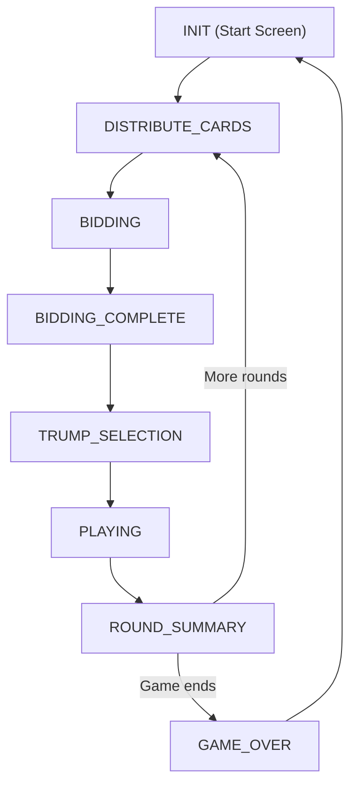

# Game Stages Documentation

This document describes the stages of the game and their transitions. All game logic and UI gating should be based on these stages.

## Stage Flow Diagram

## Stage Descriptions

- **INIT**: The game is at the start screen. Players can set up or start a new game.
- **DISTRIBUTE_CARDS**: Cards are shuffled and dealt to all players. No actions are available until dealing is complete.
- **BIDDING**: Players take turns bidding for the contract. The bidding modal is shown.
- **BIDDING_COMPLETE**: The bidding phase is over. The winner and bid amount are displayed (e.g., in a result modal).
- **TRUMP_SELECTION**: The bid winner selects the trump suit and teammate card. The trump selection modal is shown.
- **PLAYING**: The main gameplay phase. Players play cards in turn. The main game board is shown.
- **ROUND_SUMMARY**: After a round is completed, a summary modal shows the results for that round.
- **GAME_OVER**: The game has ended. The final results and winner are displayed. Players can start a new game.

## Notes
- All UI modals and game logic should be gated by the current stage.
- Transitions between stages should be handled by updating the `stage` variable in Redux.
- Only one stage should be active at any time. 