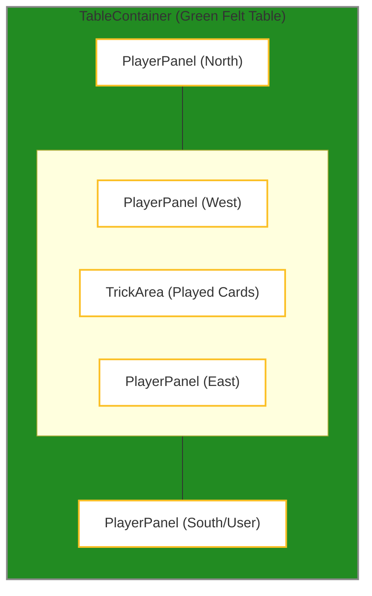
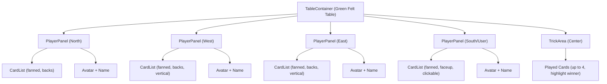

# Card Game Table UI Requirements

## High-Level Goals
- Create a visually appealing, interactive card table UI similar to classic online card games.
- Support 4 players: user (bottom), 3 opponents (top, left, right).
- User hand is face up and clickable; opponents' hands are fanned, facedown.
- Played cards (trick) are shown in the center, with the current winner highlighted.
- Avatars and names are visible for all players.
- Table is responsive and visually polished.

---

## Component Breakdown

### TableContainer
- Green felt background, rounded corners, shadow.
- Contains all PlayerPanels and TrickArea.

### PlayerPanel
- Shows avatar (circular), name, and hand (fanned).
- User hand: face up, clickable. Opponents: facedown.
- Supports north, south, east, west positions.

### CardList
- Renders a hand of cards, fanned out using CSS transforms.
- Accepts props for cards, faceDown, onCardClick, etc.

### TrickArea
- Center of table. Shows up to 4 played cards, one per player.
- Highlights the winning card.

---

## Layout Diagram



---

## Component Structure Diagram



---

## CSS Placement Logic

- Use absolute positioning inside `.table-container` for each PlayerPanel and the TrickArea.
- Example CSS:

```css
.table-container {
  position: relative;
  width: 900px;
  height: 600px;
  margin: 0 auto;
  background: #228B22;
  border-radius: 40px;
  box-shadow: 0 4px 32px #0006;
}
.player-panel.north {
  position: absolute;
  top: 32px;
  left: 50%;
  transform: translateX(-50%);
}
.player-panel.south {
  position: absolute;
  bottom: 32px;
  left: 50%;
  transform: translateX(-50%);
}
.player-panel.west {
  position: absolute;
  left: 32px;
  top: 50%;
  transform: translateY(-50%);
}
.player-panel.east {
  position: absolute;
  right: 32px;
  top: 50%;
  transform: translateY(-50%);
}
.trick-area {
  position: absolute;
  top: 50%;
  left: 50%;
  transform: translate(-50%, -50%);
  z-index: 2;
}
```

---

## Card Fanning Logic

- Use flex and absolute positioning for fanned hands.
- For each card, set a CSS variable for angle and z-index.
- Example CSS:

```css
.card-list.fanned {
  display: flex;
  justify-content: center;
  align-items: flex-end;
  position: relative;
}
.card-list.fanned .card {
  position: absolute;
  left: 50%;
  transform: translateX(-50%) rotate(var(--angle));
  z-index: var(--z);
}
```
- In JS, calculate `--angle` and `--z` for each card based on its index and total cards (e.g., -30deg to +30deg for 7 cards).

---

## Responsiveness

- Use media queries to shrink the table and panels on smaller screens.
- Example CSS:

```css
@media (max-width: 900px) {
  .table-container { width: 100vw; height: 60vw; min-width: 320px; min-height: 200px; }
  .player-panel { min-width: 60px; max-width: 100px; }
}
@media (max-width: 600px) {
  .table-container { height: 90vw; }
  .player-panel.north, .player-panel.south { left: 50%; transform: translateX(-50%); }
  .player-panel.east, .player-panel.west { top: 80%; left: 50%; transform: translate(-50%, 0); }
  .trick-area { top: 60%; }
}
```

---

## Diagrams

### Layout
```
[See Virtual Table Layout diagram above]
```

### Component Structure
```
[See Component Structure diagram above]
```

### CSS Placement
```
[See CSS Placement Logic diagram above]
```

### Card Fanning
```
[See Card Fanning Logic diagram above]
```

### Responsiveness
```
[See Responsiveness diagram above]
```

---

## Accessibility, Modularity, and Visual Polish
- Use semantic HTML and ARIA labels for interactive elements.
- Make all components prop-driven and reusable.
- Use CSS variables for colors and spacing.
- Add hover/focus states for cards and buttons.
- Use box-shadows, border-radius, and subtle gradients for polish.

---

## Example Props/Usage

```jsx
<TableContainer>
  <PlayerPanel position="north" avatar={...} name="Hanna" hand={...} isBot />
  <PlayerPanel position="west" avatar={...} name="Oliver" hand={...} isBot />
  <PlayerPanel position="east" avatar={...} name="Lisa" hand={...} isBot />
  <PlayerPanel position="south" avatar={...} name="You" hand={...} isBot={false} onCardClick={...} />
  <TrickArea playedCards={...} winningIndex={...} />
</TableContainer>
```

---

## Gotchas & Common Pitfalls
- **Z-index issues:** Ensure played cards and hands don't overlap incorrectly.
- **Responsiveness:** Test on multiple screen sizes; avoid fixed px units where possible.
- **Card fanning math:** Angles and z-index must be calculated for each hand size.
- **Avatar overlap:** Use negative margins or absolute positioning for avatars.
- **Performance:** Avoid unnecessary re-renders by memoizing hands and props.

---

## Final Notes
- Reference the diagrams for layout and CSS logic.
- Keep components small and focused.
- Ask for feedback early if unsure about visual details or layout math. 