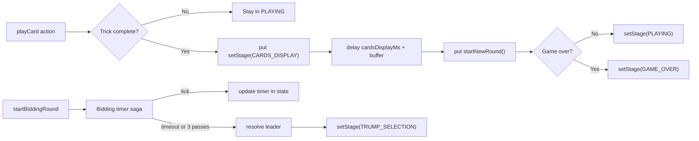

Great idea. Here’s a clear, incremental, phase-by-phase plan to simplify Redux state, centralize transitions in sagas, remove redundancies, and make everything more intuitive—ready to be dumped into plan.md.

# Redux and Saga Refactor Plan (Phase-by-Phase)

Goal: Simplify game state, centralize flow transitions in saga, eliminate redundant flags, remove non-serializable data from Redux, and make selectors the primary interface for components—without breaking existing functionality.

High-level strategy:

- Introduce selectors and adapter utilities first to avoid breaking UI
- Shift "flow" orchestration into sagas (single source of truth for transitions/timers)
- Collapse redundant flags into derived selectors
- Remove non-serializable entities from Redux (e.g., bot agents)
- Rename fields to clearer domain names with temporary adapters to keep components working
- Update components gradually to rely on selectors instead of raw state

-------------------------------------------------------------------------------

Phase 0 — Foundations and Safety Nets

- Objectives:
  - Add central constants and selectors to be the stable API for UI
  - Keep current UI fully functional while we refactor behind selectors
- Changes:
  - Create src/store/selectors.ts with memoized selectors:
    - getStage, isBidding, isPlaying, isCardsDisplay
    - getCurrentTrick, getTrickWinner, getLeadingSuit
    - getTrumpSuit, getBidInfo, getCurrentBidder
    - getTeams, getTeamForPlayer, getScores
  - Consolidate timings in src/utils/constants.ts (animation + saga delays)
  - Add JSDoc comments for each selector
- Files to create:
  - src/store/selectors.ts
- Files to update:
  - src/utils/constants.ts (add TIMINGS.{cardsDisplayMs, collectionBufferMs, biddingTimerStepMs})
  - src/pages/GameRedux.tsx (switch to selectors where trivial and risk-free)
- Acceptance:
  - No UI/behavior changes; all screens work exactly as before

-------------------------------------------------------------------------------

Phase 1 — Centralize Stage Transitions in Saga

- Objectives:
  - Move all stage transitions and timers to saga to avoid scattered logic
- Changes:
  - In gameSaga.ts:
    - Add watcher for playCard to detect trick completion; then:
      1) compute winner (or read from reducer after it sets roundWinner)
      2) setStage(CARDS_DISPLAY) and start animation timing
      3) after animation delay + buffer, dispatch startNewRound
    - Ensure setStage is the only way to change stage
  - In gameSlice.ts:
    - Remove direct stage mutations from reducers (except via setStage)
- Files to update:
  - src/store/gameSaga.ts
  - src/store/gameSlice.ts
- Acceptance:
  - Card collection animation runs reliably; next round starts only after saga delay
  - No regressions in bidding/trump selection flow

-------------------------------------------------------------------------------

Phase 2 — Remove Redundant Flags (replace with selectors)

- Objectives:
  - Eliminate duplicated/derived booleans that cause confusion
- Candidates to remove or derive:
  - showCardsPhase → derive from stage === CARDS_DISPLAY
  - isCollectingCards → derive from stage === CARDS_DISPLAY
  - isRoundEnding → derive from tableCards.length === 0 and previous stage, or from a computed selector isTrickResolved
- Changes:
  - Add selectors to encapsulate these derivations
  - Deprecate fields in GameState; keep temporary compatibility in selectors if any code still reads them
- Files to update:
  - src/types/game.ts (mark deprecated in comments)
  - src/store/selectors.ts
  - src/store/gameSlice.ts (stop writing deprecated fields)
  - src/pages/GameRedux.tsx + any component using these props
- Acceptance:
  - No change in UI, all logic uses selectors; deprecated fields no longer written

-------------------------------------------------------------------------------

Phase 3 — Make Bidding State Minimal and Clear

- Objectives:
  - Keep only core items; derive the rest via selectors
- Proposed structure:
  - bidding: {
    order: number[]                // turn order of players
    index: number                  // pointer to current bidder in order
    bids: Record   // last valid bid per player
    passed: Set            // store as array in Redux, selector exposes Set
    leader: { player: number; amount: number } | null
    timer: number                  // countdown value for UI
    }
- Remove/derive:
  - biddingActive → derive from stage === BIDDING
  - bidStatusByPlayer → derive from bids + passed
  - bidWinner → derive from leader when bidding ends
  - currentBid/currentBidder → derive from leader/index/order via selectors
- Saga:
  - Maintain timer in saga (still update timer value in Redux for UI)
  - Stop timer when stage changes from BIDDING
- Files to update:
  - src/types/game.ts (BiddingState)
  - src/store/gameSlice.ts (reducers to mutate new structure)
  - src/store/gameSaga.ts (timer + end-of-bidding transition)
  - src/store/selectors.ts (getCurrentBidder, getLeaderBid, getHasPassed, getCanRaise, isBiddingOver)
  - Components using bidding data (BiddingModal, GameRedux)
- Acceptance:
  - Bidding UI unchanged; code is simpler and more consistent

-------------------------------------------------------------------------------

Phase 4 — Clarify Domain Naming (with adapters)

- Objectives:
  - Improve naming without breaking consumers immediately
- Rename (internal first, with selector adapters):
  - runningSuite → leadingSuit
  - tableCards → trick
  - round → trickNumber (keep totalRounds if it truly means total tricks)
  - trumpSuite → trumpSuit
  - bidder → bidLeader (or highestBidder)
- Changes:
  - Keep old selector names that map to new fields for backward compatibility
  - Add TODO notes to remove adapters once components are migrated
- Files to update:
  - src/types/game.ts
  - src/store/selectors.ts (old → new compatibility layer)
- Acceptance:
  - No UI changes; selectors continue to satisfy current components

-------------------------------------------------------------------------------

Phase 5 — Teams Simplification

- Objectives:
  - Make one source of truth for teams
- Approach:
  - Keep either:
    - playerTeamMap: Record
    - OR teams: Record
  - Choose playerTeamMap as canonical; derive teams via selector
  - Add getTeamForPlayer and getTeamRoster selectors
- Files to update:
  - src/types/game.ts (deprecate one structure)
  - src/store/gameSlice.ts (stop writing the deprecated one)
  - src/store/selectors.ts
  - Update any components referencing the deprecated one
- Acceptance:
  - No behavior changes; simplified mental model

-------------------------------------------------------------------------------

Phase 6 — Remove Non-Serializable Data from Redux

- Objectives:
  - Ensure Redux only holds serializable state
- Changes:
  - Remove playerAgents from Redux
  - Create src/agents/registry.ts:
    - BotRegistry.set(index, agent)
    - BotRegistry.get(index)
    - BotRegistry.clear()
  - Inject/initialize registry from GameRedux on startGame; saga calls into registry when needed (via call effects or action→component logic)
  - Update middleware ignoredPaths config (remove playerAgents)
- Files to create:
  - src/agents/registry.ts
- Files to update:
  - src/store/index.ts (remove ignoredPaths config for playerAgents)
  - src/pages/GameRedux.tsx (initialize BotRegistry on new game)
  - src/store/gameSaga.ts (read from registry instead of Redux)
- Acceptance:
  - No behavior changes; no non-serializable warnings

-------------------------------------------------------------------------------

Phase 7 — Component Migration to Selectors

- Objectives:
  - Make components selector-driven and props-light
- Changes:
  - GameRedux.tsx: use selectors for everything; minimize inline transforms
  - BiddingModal, TrumpSelectionModal, BidResultModal, RoundSummaryModal, CenterTable, PlayerArea:
    - Replace direct state field access with selectors
    - Remove local duplication of derivations (e.g., who’s turn, leading suit)
- Files to update:
  - src/pages/GameRedux.tsx
  - src/components/game/*.tsx (as needed)
- Acceptance:
  - Code is cleaner; easier to reason about flows; no UI changes

-------------------------------------------------------------------------------

Phase 8 — Clean Up Deprecated Fields and Adapters

- Objectives:
  - Remove technical debt after safe migration
- Changes:
  - Delete deprecated fields from GameState and reducers
  - Remove adapter selectors and old names
  - Update types to final names (no aliases)
- Files to update:
  - src/types/game.ts
  - src/store/selectors.ts
  - src/store/gameSlice.ts
- Acceptance:
  - Build is clean; no references to deprecated fields; tests pass

-------------------------------------------------------------------------------

Phase 9 — Documentation and Dev UX

- Objectives:
  - Make maintenance easy and onboarding fast
- Changes:
  - Update README.md with state shape and saga responsibilities
  - Add diagrams for stage flow in plan.md
- Files to update:
  - README.md
  - plan.md
- Acceptance:
  - Contributors can understand state at a glance

-------------------------------------------------------------------------------

Mermaid: Target Stage Flow After Refactor

-------------------------------------------------------------------------------

Files to Create (summary)

- src/store/selectors.ts
- src/agents/registry.ts

Key Principles We’ll Enforce

- Only sagas change stages (reducers do not transition stages arbitrarily)
- Redux contains only serializable data
- Components consume selectors, not raw nested state
- Derived booleans are not stored—selectors compute them
- Clear, domain-appropriate names with temporary adapters during migration

Rollback Plan

- Each phase is self-contained and reversible via git revert
- Adapter selectors guarantee UI stability during transitions
- We’ll commit per-phase with messages explaining changes

Success Criteria

- Fewer fields in GameState with no loss of features
- Zero non-serializable paths in Redux store
- All transitions observable and controlled by saga with centralized timings
- Components rely on selectors and are easier to maintain
- No regressions in gameplay, bidding, or animations

Implement the plan