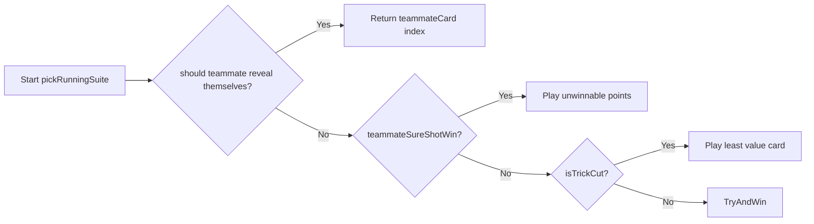
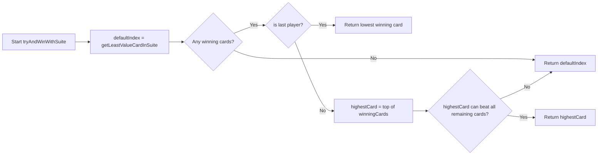

- `startTrick()`

// todo

- `pickRunningSuite()`

```mermaid
---
config:
  layout: dagre
---
flowchart LR
    A["Start pickRunningSuite"] --> C{"should teammate reveal themselves?"}
    C -- Yes --> D["Return teammateCard index"]
    C -- No --> E{"teammateSureShotWin?"}
    E -- Yes --> F["Play unwinnable points"]
    E -- No --> H{"isTrickCut?"}
    H -- Yes --> I["Play least value card"]
    H -- No --> J["TryAndWin"]

```

Important Util functions:

- TryAndWin: `tryAndWinWithSuite()`

```mermaid
---
config:
  layout: dagre
---
flowchart LR
  A[Start tryAndWinWithSuite] --> C[defaultIndex = getLeastValueCardInSuite]
  C --> D{Any winning cards?}
  D -- No --> E[Return defaultIndex]
  D -- Yes --> F{is last player?}
  F -- Yes --> G[Return lowest winning card]
  F -- No --> H[highestCard = top of winningCards]
  H --> I{highestCard can beat all remaining cards?}
  I -- Yes --> J[Return highestCard]
  I -- No --> E
```
